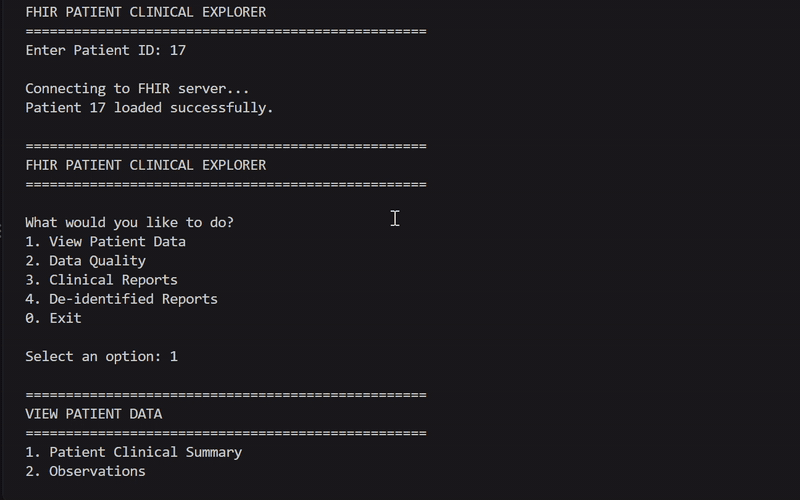

# FHIR Patient Clinical Explorer

A Python command-line application for exploring patient data from an HL7 FHIR R4 server, analysing clinical observations, generating reports, and demonstrating selected de-identification and audit-trail practices.


## Why I Built This

My background in healthcare administration exposed me to the operational side of electronic medical records and patient information.

I wanted to understand what happens beyond the EMR interface — how clinical information can be represented as structured data, exchanged between systems, queried through APIs, validated, and transformed into useful reports.

This project was my hands-on introduction to FHIR interoperability and healthcare data engineering.

---

## What It Does

The application:

- Retrieves `Patient`, `Observation`, `Practitioner`, and `Encounter` resources
- Uses FHIR REST APIs and JSON
- Uses `_include` and `_include:iterate` to retrieve related resources
- Handles FHIR SearchSet Bundles
- Follows server-provided pagination links
- De-duplicates resources returned across Bundle pages
- Extracts LOINC-coded clinical measurements
- Handles component-based observations such as blood pressure
- Performs clinical data-quality checks
- Identifies observations with missing clinical dates or values
- Generates identified clinical reports
- Generates de-identified clinical reports
- Exports reports as TXT and JSON
- Exports analytics as JSON and CSV
- Maintains a local audit trail for report exports
- Includes automated tests with pytest
- Runs the test suite automatically through GitHub Actions

---

## Demo

A short walkthrough of the FHIR Patient Clinical Explorer in action.



## Architecture

```text
                    FHIR R4 Server
                         │
                         │ REST / JSON
                         ▼
                  ┌───────────────┐
                  │ fhir_client.py│
                  └───────┬───────┘
                          │
                          ▼
                    SearchSet Bundle
                          │
             ┌────────────┼────────────┐
             ▼            ▼            ▼
       Clinical       Analytics      Reports
       Summary        & Quality      TXT/JSON
             │            │            │
             │            │            ▼
             │            │      De-identified
             │            │          Report
             │            │            │
             └────────────┴────────────┘
                          │
                          ▼
                    Audit Trail
```

### Project modules

| Module | Responsibility |
|---|---|
| `src/main.py` | CLI, menu navigation, exports, and audit logging |
| `src/fhir_client.py` | FHIR HTTP requests, Bundle retrieval, pagination, and resource de-duplication |
| `src/clinical_summary.py` | Patient and related-resource summaries |
| `src/clinical_analytics.py` | Clinical analytics, data-quality checks, JSON and CSV exports |
| `src/clinical_report.py` | Identified and de-identified clinical report generation and report exports |
| `tests/` | Automated test suite |

---

## FHIR Resources

The project works with these FHIR R4 resources:

- `Patient`
- `Observation`
- `Practitioner`
- `Encounter`
- `Bundle`

For patient clinical retrieval, the application uses:

```text
subject=Patient/{patient_id}
_include=Observation:subject
_include=Observation:performer
_include:iterate=Observation:encounter
```

The client also follows server-provided `next` Bundle links and de-duplicates resources using their `resourceType/id` identity.

---

## LOINC Measurements

The demonstration data includes common LOINC-coded measurements:

| LOINC | Concept |
|---|---|
| `85354-9` | Blood pressure panel |
| `8480-6` | Systolic blood pressure |
| `8462-4` | Diastolic blood pressure |
| `4548-4` | Hemoglobin A1c |

The application extracts measurement values, units, clinical dates when available, and observation status.

---

## Clinical Data Quality

The analytics module checks the completeness of clinical observations.

It reports:

- Total observations
- Observations with values
- Observations without values
- Observations with clinical dates
- Observations without clinical dates
- Resource counts for observations, practitioners, and encounters

When clinical dates or values are missing, the application reports the missing information rather than treating the record as unusable.

---

## Clinical Reports

The application can generate identified clinical reports containing:

- Patient ID
- Patient name
- Gender
- Birth date
- Clinical observations
- LOINC codes
- Clinical dates when available
- Measurement values and units
- Related practitioners
- Related encounters
- Report timestamp

Reports can be exported as TXT or JSON.

Generated report files are excluded from Git through `.gitignore`.

---

## De-identification

The current implementation demonstrates selected de-identification techniques.

| Field | Treatment |
|---|---|
| Patient ID | `[REDACTED]` |
| Name | `[REDACTED]` |
| Birth date | Reduced to birth year |
| Gender | Retained |
| Clinical observations | Retained |
| LOINC codes | Retained |

### Important limitation

This is a **technical demonstration**, not a complete HIPAA Safe Harbor implementation.

The current implementation does not comprehensively scan every possible identifying field, including addresses, contact information, free-text content, or other identifiers that may exist in FHIR resources.

The de-identified output should therefore not be treated as a production-ready compliant de-identified dataset.

---

## Audit Trail

Report exports are recorded in:

```text
clinical_report_audit.log
```

Each audit entry records:

- Timestamp
- Export action
- Source patient ID
- Output filename

Example format:

```text
YYYY-MM-DD HH:MM:SS | Action: Export de-identified clinical report TXT | Patient ID: <source-patient-id> | File: clinical_report_deidentified.txt
```

The audit log contains the source patient ID and is therefore sensitive. It is excluded from Git through `.gitignore`.

> A real audit-log entry will be added to the documentation after generating an export during the final demonstration.

---

## Quick Start

### Requirements

- Python 3.10+
- Access to an HL7 FHIR R4 server
- Python packages listed in `requirements.txt`

### Clone the repository

```bash
git clone https://github.com/NenKimwa/fhir-patient-clinical-explorer.git
cd fhir-patient-clinical-explorer
```

### Install dependencies

```bash
python -m pip install -r requirements.txt
```

### Configure the FHIR server

The application reads the FHIR server URL from the `FHIR_BASE_URL` environment variable. If it is not set, the default is:

```text
http://localhost:8080/fhir
```

Windows PowerShell example:

```powershell
$env:FHIR_BASE_URL="http://localhost:8080/fhir"
```

### Run the application

```bash
python src/main.py
```

---

## CLI Menu

The current CLI provides:

```text
FHIR PATIENT CLINICAL EXPLORER

1. Patient Clinical Summary
2. Observations
3. Practitioner
4. Encounter
5. Full Clinical Bundle
6. Exit
7. Clinical Analytics
8. Export Analytics to JSON
9. Export Analytics to CSV
10. Generate Clinical Report
11. Export Clinical Report to TXT
12. Export Clinical Report to JSON
13. Generate De-identified Clinical Report
14. Export De-identified Report to TXT
15. Export De-identified Report to JSON
```

---

## Example Clinical Data

The project was developed and tested against a local HAPI FHIR server using synthetic demonstration data.

```text
Patient
  Patient/17

Observations
  Observation/18
    Blood pressure
    Systolic: 120 mmHg
    Diastolic: 80 mmHg

  Observation/52
    HbA1c: 5.8 %

Practitioner
  Practitioner/19

Encounter
  Encounter/53
```

The demonstration dataset contains no real patient data.

---

## Testing

The project includes automated tests covering:

- Observation extraction
- Clinical analytics
- LOINC extraction
- Observation values
- Clinical dates
- Measurement interpretation
- Identified clinical reports
- De-identified clinical reports
- FHIR pagination and resource de-duplication

Run the tests with:

```bash
python -m pytest -q
```

Expected result:

```text
9 passed
```

The test suite is designed to run without requiring a live FHIR server.

### Continuous Integration

GitHub Actions automatically runs the test suite on pushes and pull requests.

The CI workflow:

1. Checks out the repository
2. Sets up Python 3.10
3. Installs the project dependencies
4. Runs pytest

---

## Privacy and Security Notes

This project is designed as a healthcare data engineering and interoperability learning project.

Important safeguards include:

- Generated clinical exports are excluded from Git
- The audit log is excluded from Git
- De-identified reports remove selected direct identifiers
- The project uses synthetic demonstration data
- The application should not be connected to real patient data without appropriate authorization, security controls, and privacy safeguards

---

## Limitations

This is a portfolio and learning project, not a production clinical system.

Current limitations include:

- De-identification does not cover every possible identifier
- The audit trail is currently a local text log rather than a FHIR `AuditEvent`
- Clinical trend analysis is limited when observations do not contain usable clinical dates
- The project currently focuses on read-oriented FHIR workflows
- No clinical decision support is provided

---

## Future Improvements

Planned improvements include:

- FHIR-native audit trails using `AuditEvent` and `Provenance`
- Larger synthetic datasets using Synthea
- Additional FHIR search patterns
- `Patient/$everything` exploration
- More `_include` and `_revinclude` use cases
- Clinical trend analysis for observations with usable dates
- Expanded de-identification coverage
- Additional integration and performance testing
- Easier installation and deployment

---

## Disclaimer

This is a portfolio and learning project.

It is **not**:

- A medical device
- A clinical decision-support system
- A production electronic medical record
- A substitute for professional clinical judgement

Do not use its outputs to make clinical decisions.

---

## Author

**Nenkimwa Simon Gokop**

Healthcare Administration · Healthcare Data · FHIR Interoperability · AI & Automation

GitHub: [@NenKimwa](https://github.com/NenKimwa)

---

## License

This project is licensed under the MIT License. See [`LICENSE`](LICENSE) for details.
